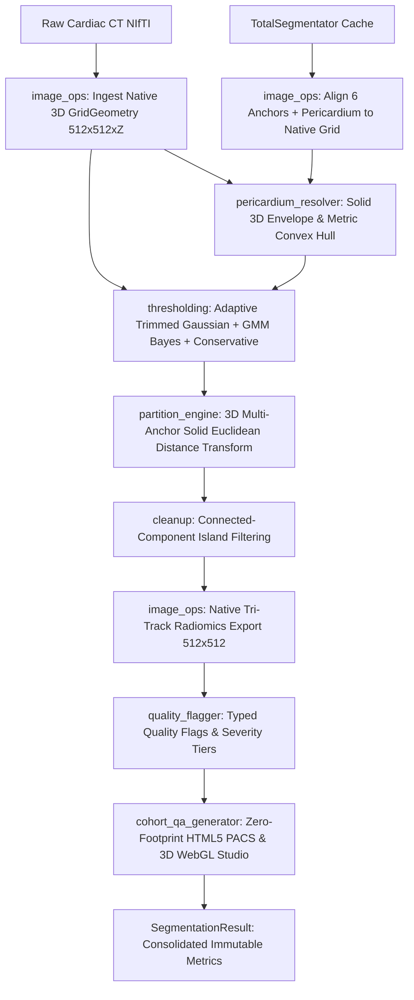

# LA Fat Segmentation — Deep Pipeline Rebuild

[](https://www.python.org/downloads/)
[](https://opensource.org/licenses/MIT)
[](https://github.com/psf/black)

A scientifically validated, production-grade, deep-module Left Atrial Epicardial Adipose Tissue (**LA EAT**) segmentation pipeline for non-contrast cardiac CT.

Designed for high-throughput batch analysis, IBSI-standardized PyRadiomics feature extraction, and automated clinical quality assurance.

---

## Key Highlights

- **Multi-Anchor 3D Solid Distance Partition**: Replaces fragile anatomical heuristics with a physically grounded 3D Euclidean surface distance transform across 6 canonical cardiac chambers ({LA, LV, RA, RV, Aorta, Pulmonary Artery}).
- **Tri-Track Density Architecture**:
  1. **Primary Adaptive Trimmed Gaussian** ($r = 0.9526, p = 2.08 \times 10^{-5}$ vs clinical scanner baseline).
  2. **Two-Component GMM Bayes** ($P(\text{Fat} \mid x) \ge 0.5$, $r = 0.9603, p = 1.09 \times 10^{-5}$).
  3. **Conservative Fixed Consensus** ($[-190, -30]$ HU, $r = 0.9236$).
- **Full-Resolution Native DICOM Grid Radiomics**: Operates directly on native CT resolution ($512 \times 512 \times Z$, $\sim 0.28\text{–}0.35\text{ mm}$ in-plane) with zero downsampling or upsampling artifacts, exporting lossless radiomics masks (`la_fat_final_native.nii.gz`, `la_fat_gmm_bayes_native.nii.gz`, `la_fat_conservative_native.nii.gz`).
- **Zero-Footprint PACS & 3D WebGL QA Studio**: Standalone offline HTML5 application (`cohort_qa_viewer.html`) featuring multi-planar 2D orthogonal PACS scrubbers, curtain wipe, layer toggles, and interactive 3D WebGL anatomical mesh rendering with zero runtime server or npm dependencies.
- **Pure-CPU Execution & Decoupled GPU Pre-Compute**: Fat extraction runs entirely on CPU per scan. TotalSegmentator v2 runs once as an optional pre-compute step on GPU or CPU.

---

## Installation

### 1. Install Package
```bash
git clone https://github.com/marmor123/la-fat-segmentation.git
cd la-fat-segmentation
pip install -e .
```

### 2. (Optional) GPU Acceleration for TotalSegmentator
To enable GPU acceleration for the TotalSegmentator pre-computation step:
```bash
pip install torch torchvision --index-url https://download.pytorch.org/whl/cu121
```

### 3. Verify Environment
Run the built-in diagnostic tool to verify PyTorch CUDA availability, TotalSegmentator installation, and filesystem paths:
```bash
la-fat check
```

---

## Command-Line Interface (`la-fat`)

The `la-fat` executable provides a unified interface for single-scan, folder-level cohort processing, precomputing, and visualization:

```
la-fat <command> [options]
```

### 1. Single-Patient Extraction (`run`)
Extract LA epicardial fat for a single patient CT scan:
```bash
# Explicit command
la-fat run --patient 0674

# Direct shorthand
la-fat 0674

# Using custom config and output directory
la-fat run --patient 0674 --config custom_config.yaml --output-dir /path/to/outputs
```

### 2. Folder-Level & Cohort Batch Processing (`batch`)
Process all `.nii.gz` / `.nii` scans in a folder, generate summary CSV metrics, and compile the multi-tab QA dashboard:
```bash
# Process all CT scans in a directory
la-fat batch --input-dir /path/to/ctscans --output-dir /path/to/outputs

# Process specific patient IDs from data/raw/
la-fat batch --patient-ids 0674,1512,2996

# Recompute already processed patients
la-fat batch --input-dir /path/to/ctscans --force
```

### 3. TotalSegmentator Precomputation (`precompute`)
Extract and cache anatomical masks ({LA, LV, RA, RV, Aorta, Pulmonary Artery, Pericardium, Pulmonary Veins}):
```bash
# Precompute a single patient using GPU (auto-detected)
la-fat precompute --patient 0674

# Precompute an entire folder of scans on GPU
la-fat precompute --input-dir /path/to/raw_scans --device gpu

# Precompute using fast mode on CPU
la-fat precompute --input-dir /path/to/raw_scans --device cpu --fast
```

### 4. Zero-Footprint QA Studio (`dashboard`)
Open the interactive HTML5/WebGL QA Studio in your default browser:
```bash
# Open cohort QA studio (all scans)
la-fat dashboard

# Open specific patient QA report
la-fat dashboard --patient 0674

# Open dashboard from a custom output directory
la-fat dashboard --output-dir /path/to/outputs
```

### 5. Clinical Correlation Benchmark (`benchmark`)
Run correlation analysis against scanner software baseline measurements across the verified 10-patient cohort:
```bash
la-fat benchmark
```

### 6. Help & Options
Display comprehensive help with examples for any command:
```bash
la-fat --help
la-fat run --help
la-fat batch --help
la-fat precompute --help
```

---

## Pipeline Architecture & DAG

The pipeline follows a clean, immutable pure-function architecture with typed frozen dataclasses across 8 deep modules:



### Deep Module Seams

| Module | Core Responsibility | Key Function / Seam |
|---|---|---|
| `la_fat.image_ops` | Native spatial geometry, affine preservation, reference-locked alignment | `GridGeometry`, `resample_to_reference()` |
| `la_fat.pericardium_resolver` | Pericardial boundary resolution with metric convex hull fallback | `resolve_pericardium()` |
| `la_fat.thresholding` | Trimmed Gaussian fit, GMM Bayes, Bayesian MAP prior | `compute_fat_threshold()`, `fit_trimmed_gaussian()` |
| `la_fat.partition_engine` | Multi-anchor 3D Euclidean Distance Transform partition | `partition_fat()` |
| `la_fat.cleanup` | Minimum connected-component island filtering | `cleanup_la_fat_mask()` |
| `la_fat.quality_flagger` | Quality concern detection across 3 discrete severity tiers | `generate_quality_flags()` |
| `la_fat.cohort_qa_generator` | Zero-footprint HTML5/WebGL PACS and 3D mesh report generator | `generate_cohort_qa_html()` |
| `la_fat.pipeline` | Immutable end-to-end DAG orchestrator | `run_fat_extraction()` |

---

## Output Artifacts & Structure

Running `la-fat run` or `la-fat batch` produces the following directory hierarchy:

```
data/outputs/
├── cohort_benchmark_summary.csv        # Consolidated cohort volumes, thresholds, and flags
├── cohort_qa_viewer.html               # Multi-patient PACS QA Studio + 3D WebGL mesh viewer
└── 0674/                               # Patient-specific output folder
    ├── 0674_la_fat_final_native.nii.gz # Native 512x512 Adaptive Gaussian radiomics mask
    ├── 0674_la_fat_gmm_bayes_native.nii.gz # Native 512x512 GMM Bayes radiomics mask
    ├── 0674_la_fat_conservative_native.nii.gz # Native 512x512 Conservative [-190,-30] mask
    ├── la_fat_mask.nii.gz              # Primary native LA fat segmentation
    ├── pipeline_result.json            # Machine-readable metrics and quality flags
    └── qa_report.html                  # Standalone patient PACS QA report
```

---

## Quality Audit Flags

Quality concerns are reported as discrete, typed flags rather than opaque composite scores:

- **High Severity** (Requires clinical review):
  - `PERICARDIUM_FALLBACK`: TS pericardium volume $< 50\text{ mL}$; convex-hull fallback used.
  - `ANCHOR_MISSING`: One or more canonical cardiac chambers missing.
  - `FAT_THRESHOLD_FALLBACK`: Monotonic/low-fat distribution; defaulted to $[-190, -30]\text{ HU}$.
- **Medium Severity**:
  - `LA_FAT_VOLUME_OUT_OF_RANGE`: LA fat volume outside $2.0 - 60.0\text{ mL}$.
  - `LV_LA_RATIO_HIGH`: LV/LA fat ratio exceeds $4.0$.
  - `UNASSIGNED_FAT_HIGH`: $>80\%$ of epicardial fat voxels unassigned.
  - `LOW_FAT_FRACTION`: Total EAT $<8\%$ of pericardial cavity.
- **Low Severity**:
  - `WIDE_SIGMA_WARNING`: Gaussian $\sigma > 25.0\text{ HU}$.
  - `HU_RANGE_CLAMPED_LOW` / `HU_RANGE_CLAMPED_HIGH`: Threshold tails clamped to bounds.

---

## Clinical Validation Benchmark

Evaluated on the full 10-patient Siemens Somatom Force Flash CT clinical cohort (120 kVp, non-contrast slices, native in-plane pixel spacing $0.28 - 0.36\text{ mm}$):

| Method | Pearson Correlation ($r$) | Spearman Rank ($\rho$) | $p$-value |
|---|---|---|---|
| **GMM Bayes ($P \ge 0.5$)** | **0.9584** | **0.9394** | **$1.24 \times 10^{-5}$** |
| **Conservative Fixed Window ($[-190, -30]\text{ HU}$)** | **0.9463** | **0.9152** | **$3.40 \times 10^{-5}$** |
| **Adaptive Trimmed Gaussian** | **0.9321** | **0.9152** | **$8.54 \times 10^{-5}$** |

---

## Testing & Verification

Run the test suite with `pytest`:
```bash
pytest -v
```

---

## License

This project is licensed under the MIT License — see the [LICENSE](LICENSE) file for details.
